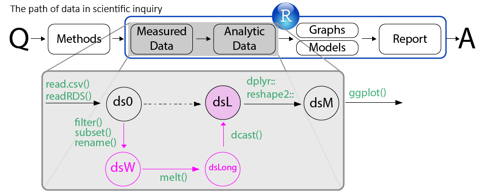
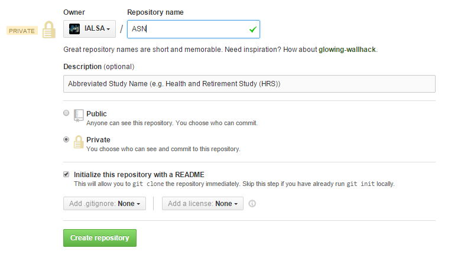

Establishing Data Access  to the data of a specific study. 

Today we will try start on the process of study curation. Ever member of the lab will "adopt" a study, which s/he works or would like to work and practice delivering the study's data to the **dsL** stage, as discussed described [here](http://ialsa.github.io/tutorials/LabLog/26-09-2014-Dementia-Personality-OCTO.html) and at [COAG colloquium](http://ialsa.github.io/COAG-colloquium-2014F/2014-10-21-Data-Manipulation.html#10). 
  
Each study will be placed in a separate repository that would contain the code for preparing the study's data for analysis. These repositories will be the first step in the research projects based on these studies.


#A. Creating a repository  
  You can create a new repository either at the github.com/user-name webpage ( in this case, at the IALSA organization account github.com/ialsa) or inside the GitHub client. I will describe the former option. With it implemented, the cloning of the created repository could be accomplished by the sequence of steps described in the part I of [from RAW do DRAW](http://ialsa.github.io/tutorials/LabLog/19-09-2014-From-Raw-to-Draw.html) session.   
  
  1.  open [github.com/ialsa](http://ialsa.github.io/tutorials/LabLog/19-09-2014-From-Raw-to-Draw.html). Make sure you are logged on.    
  
  2. click "+ New Repository" button in the middle of the screen. The menu will appear: 
  
  3. Use the abbreviation of the study to name your repository. If data is sensitive and cannot be shared publically, select a **Private** repository. If you are working on a paper for which you'd rather not disclose details yet, select **Private** too. Do however, prefer public repos. Private repos are valuable. We, as an organization get 20 private repoes. You, as an academician can [request](https://education.github.com/guide/private_repos) up to 5. Ask for an individual account.  
  
  4. Add a brief description. In our current case, it will be a full name of the study, years of collection and the nature of the data. We are creating data access point to the data collected and preserved by a particular study.  
  
  5. Check "Initialize this repository with a README" box  
  
  6. 
  
#B. Adding Study Description 
  The purpose of this repository is to make data in a particular study approachable. This means providing clear and thorough documentation. Therefore managing project description will be just as important as developing the code itselt. We'll be developing  and storing our documentation in  a format called **markdown**. Files, stored in this format have extention **.md**  The first opportunity to practice markdown editing will be with the description of this project and the associated study. 
  

##  Basic markdown editing
  A repository is basically a folder, which you will populate with other folders, data, scripts, images, and other files. At this moment a single file exists in your repository, called **README.md**. 
  
Notice that README is spelled with all caps. Files of this name are automatically rendered by GitHub  into html which you see down below at the root folder of your newly created repository. When you click on **README.md**, you're are taken to the menu where you can view or edit the contents of this file.   
    
With editing mode activated by clicking the pencil icon we can start typing in additional information we'd like the researchers to see the first thing when they open this GitHub repository. The goal of this repository is to deliver access to the data of a particular study, so don't write 4000 words worth of description. Write in the "inverted pyramid" format : give the essense first formulated as a sentence, then a paragraph, and then if, necessary in a series of paragraphs.  The key information, however, ideally should be delivered withing 10 seconds of looking at the page.  
  
</br>
**README.md** is actually a script that instructs how the webpage should be assembled. The language used in this script is call **markdown**, which is probably the simplest programming language out there. Markdown is text that has been somehow "marked"  to impress additional information on it, such as size or color of the font, bullets, numbers, tables, etc. Very simple, yet fundamental building blocks of textual information in practice. See this [3 minute read](https://guides.github.com/features/mastering-markdown/) on what is markdwon and its basic syntax. 


### Adding links
  One can add  a hyperlink by eclosing the target name in square brackets followed by target url in parentheses    
  
  ```
  [target name](http://target.com/target-url.html)  
  ```
  
  Notice thet there are no blanks between "]" and "(". Aslo make sure that you don't leave out "http://", otherwise it will start looking for files in your local folder.
  

### Adding images
  same as for links, but now preceded by "!" before the square brackets:  
  
  ```
  
  ```
  </br>
  See [3 minute read](https://guides.github.com/features/mastering-markdown/) for more markdown sytax. 
  
  <div style="color:red";>NOTE:</div> Ideally, each folder must contain a readme file with a brief description. This adds to the transparency of the project and directly influences its reproducibility. Do take time to write up and update REAMDME files.
  

#C. Key Folders
  Each project is unique, but there will be some folders, which name and functionality are kept constant for the sake of standardization of data preparation. The key folder, which we'll create today are
<div class="breadcrumb">./Data/</div>
and
<div class="breadcrumb">./Scripts/</div> 

#### Data
  - contains subfolders
  <div class="breadcrumb">./Data/Raw</div>
  that stores the original data files, and the folder. 
<div class="breadcrumb">./Data/Derived</div>
containing the data ready for analysis. Typically, this dataset will be call <code>dsL.R</code>. 

#### Scripts
  We'll store scripts in separate files bases on what they do so that we can used them in idependent modules, thus saving time and keeping our code flexible. We'll sort scripts into folders according to the function they carry out. Typically, we'll have at least two folders here:
<div class="breadcrumb">./Scripts/Data</div>
containing scripts operating on data (among which is <code>dsL.R</code>) and 
<div class="breadcrumb">./Scripts/Utility</div>
containing service scripts. A particular script to take notice of is
<div class="breadcrumb">./Scripts/Utility/InstallPackages.R</div>
which you would run in the beginning of the RStudio session to install all necessary packages. 

<div style="color:red";>Assignment:</div> 
 1. Create folder Scripts, and subfolders Data and Utility
 2. Creat "README.md" file for each folder
 3. Find <code>/Scripts/Utility/InstallPackages.R</code> in some other [repository](https://github.com/IALSA/COAG-colloquium-2014F/tree/master/Scripts/Utility) and save a copy in the appropriate folder


#D. Adding .gitignore
 A file in the root 
<div class="breadcrumb">.gitignore</div>
contains instructions on what content in the project to prevent from uploading into the cloud and making public. <span style="color:red";>YOU ARE PERSONALLY RESPONSIBLE FOR KEEPING YOUR DATA SECURE BY EDITING .gitignore</span>. Sorry for yelling, but his is very important.
</br>
Here's an example on how to assign permissions:
```
Data/Raw/*
!Data/Raw/README.md
```
All files in the folder
<div class="breadcrumb">./Data/Raw/</div>
will NOT be uploaded, which an exception (!) of "README.md" file.  Here's a starter code with some referenced documentation
```
# R and RStudio files.
.Rhistory
.RData
.Rproj.user/

# Protected Information; see cubuspl42's answer in http://stackoverflow.com/questions/2415873/exceptions-in-gitignore
Data/Derived/ds0.Rds


# Keep the README files in the unshared directories.  They provide documentation, and also force the directories to be created on other machines.
!DataUnshared/README.md
!DataUnshared/Contents.md
!DataUnshared/Raw/README.md
!DataUnshared/Derived/README.md

# Example code in package build process with a wildcard.
*-Ex.R

# Exclude caches in case they contain PHI
cache/
*/cache/
*/*/cache/
```

#F. Starting dsL.R script
  After having established data security, we place our data to 
  <div class="breadcrumb">./Data/Raw/</div>
  and beging developing the script
  <div class="breadcrumb">./Scripts/Data/dsL.R</div>
  that will place a prepared data object into
  <div class="breadcrumb">./Data/Derived/Unshared</div>
