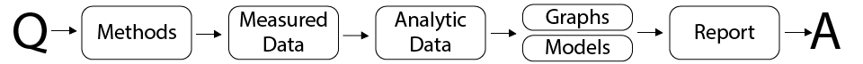
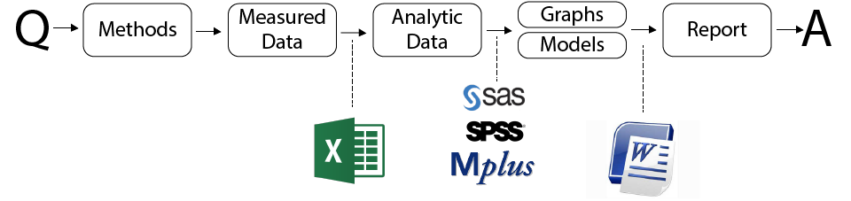
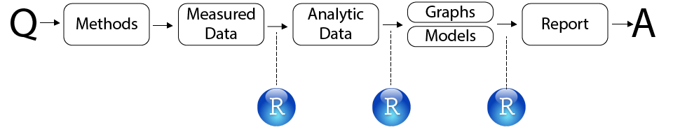
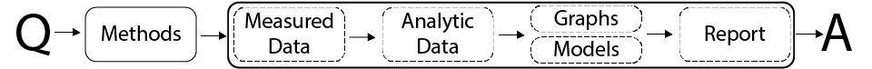
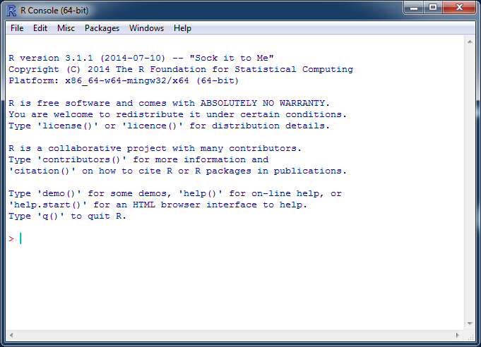
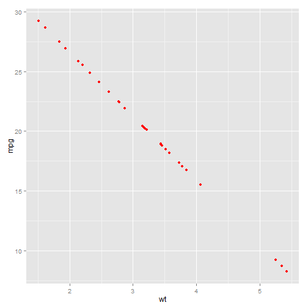

<style type="text/css">
.small-code pre code {
   font-size: 1.1em;
}
</style>


Toolbox and Skillset of Reproducible Research
========================================================
author: Andrey Koval
date: October 14, 2014
transition: fade
transition-speed: fast


The Laboratory for Integrative Lifespan Research   
Department of Psychology  
University of Victoria  

bio
===
 - Vanderbilt, 2014
 - Quantitative Methods
 - [Joseph Lee Rodgers](http://www.vanderbilt.edu/psychological_sciences/bio/joe-rodgers) 
 - Research Interests: longitudinal modeling and statistical graphics
 - Dissertation: how dynamic documents can help in statistical modeling

  
Workflow in research projects
===
  

Academic Paper: 
- Introduction
- Methods
- Results
- Discussion

Workflow in research projects
===



Workflow in research projects
===



Workflow in research projects
===


Advantages of RR
========================================================


- Less prone to human error  
- Removes tedious jobs  
- Recordable workflow  
- Correcting mistakes later  
- Synchronizes analysis and discussion  

TOOLBOX and toolset of RR
========================================================

 - R
 - RStudio
 - GitHub
 
 TOOLBOX : R
========================================================



 TOOLBOX : RStudio
========================================================


 TOOLBOX : GitHub
========================================================

[GitHub](github.com)
 

toolbox and SKILLSET of RR
========================================================
 
 - Data Manipulation  
 - Graph Production  
 - Statistical Modeling  
 - Dynamic Reporting  
 
 see [ialsa.github.io/tutorials](ialsa.github.io/tutorials) for knowledge base


Goals of RR
========================================================

</br>
**Ultimate** : Answering a research question  
</br>
**Practical** : Publishing a paper, producing a manuscript   
</br>  
**Technical** : Producing a dynamic document   


RR uses code to
========================================================
  

In the process of achieving these goals we encounter the need to perform particular tasks on a computer:

**A.** Load and inspect datasets  
**B.** Depict data in statistical graphics  
**C.** Fit statistical models  
**D.** Compare observed and modeled data  
**E.** Produce reports discussing the steps above   

let's demonstrate how we can accomplish each of these tasks on a [R simulator](https://demo.ocpu.io/markdownapp/www/)


A. Load and inspect datasets
========================================================

```r
ds <- mtcars
str(ds, 10)
```

```
'data.frame':	32 obs. of  11 variables:
 $ mpg : num  21 21 22.8 21.4 18.7 18.1 14.3 24.4 22.8 19.2 ...
 $ cyl : num  6 6 4 6 8 6 8 4 4 6 ...
 $ disp: num  160 160 108 258 360 ...
 $ hp  : num  110 110 93 110 175 105 245 62 95 123 ...
 $ drat: num  3.9 3.9 3.85 3.08 3.15 2.76 3.21 3.69 3.92 3.92 ...
 $ wt  : num  2.62 2.88 2.32 3.21 3.44 ...
 $ qsec: num  16.5 17 18.6 19.4 17 ...
 $ vs  : num  0 0 1 1 0 1 0 1 1 1 ...
 $ am  : num  1 1 1 0 0 0 0 0 0 0 ...
 $ gear: num  4 4 4 3 3 3 3 4 4 4 ...
 $ carb: num  4 4 1 1 2 1 4 2 2 4 ...
```

B. Depict data as statistical graphics
========================================================

```r
require(ggplot2)
p <- ggplot(mtcars, aes(x=wt, y=mpg)) 
p <- p + geom_point()
p
```

 

C. Fit statistical models
========================================================

```r
lm(mpg ~ wt, mtcars)
```

```

Call:
lm(formula = mpg ~ wt, data = mtcars)

Coefficients:
(Intercept)           wt  
      37.29        -5.34  
```

D. Compare observed and modeled data
========================================================

```r
require(ggplot2)
ds <- mtcars
ds$mpg_modeled <- predict(lm(mpg ~ wt, mtcars))
p <- ggplot(ds, aes(x=wt, y=mpg)) 
# p <- p + geom_point() 
p <- p + geom_point(aes(y=mpg_modeled),color="red")
p
```

 

D. Compare observed and modeled data
========================================================

```r
require(ggplot2)
ds <- mtcars
ds$mpg_modeled <- predict(lm(mpg ~ wt, mtcars))
p <- ggplot(ds, aes(x=wt, y=mpg)) 
p <- p + geom_point() 
p <- p + geom_line(aes(y=mpg_modeled),color="red")
p
```

 


E. Produce report 
========================================================
We just did it!


Recap
===
Traditional 

vs Reproducible
 

Recap
===
**Toolbox**
 - R
 - RStudio
 - GitHub

***   
**Skillset**
 - Data Manipulation  
 - Graph Production  
 - Statistical Modeling  
 - Dynamic Reporting  
 

Looking ahead
===
- Oct 14 -- Toolbox and Skillset of Reproducible Research (RR) 
- Oct 21  -- RR Basic Skills (1): **Data** Manipulation
- Oct 28  -- Introduction to Latent Class and Latent Transition Models
- Nov 4  -- RR Basic Skills (2): **Graph** Production
- Nov 11  -- Remembrance Day (No Session)  
- Nov 18  -- RR Basic Skills (3): Statistical **Modeling** 
- Nov 25  -- RR Basic Skills (4): Dynamic Reporting 
- Dec 2 -- Migrating into R from other Statistical Software 
 

Resources
===
 - start with RStudio's [online learning](http://www.rstudio.com/resources/training/online-learning/)
 - for brief reviews of key books and resources see Will Beasley's [Resources Opinions](https://github.com/OuhscBbmc/RedcapExamplesAndPatterns/blob/master/DocumentationGlobal/ResourcesOpinions.md)
 - another presentation by Will will give you a excellent overview of [Statistical Collaboration with GitHub](http://htmlpreview.github.io/?https://raw.githubusercontent.com/OuhscBbmc/StatisticalComputing/master/2014_Presentations/05_May/BeasleyScugGitHub2014-05.html#/)
 - Winston Chan's [R Cookbook](http://shop.oreilly.com/product/9780596809164.do) is a perfect book to get you started with producing graphs with RStudio
 - [Quick-R](http://www.statmethods.net/) - thorough and convenient resource for R reference
 

Fin
===
Questions?  
Comments?  


